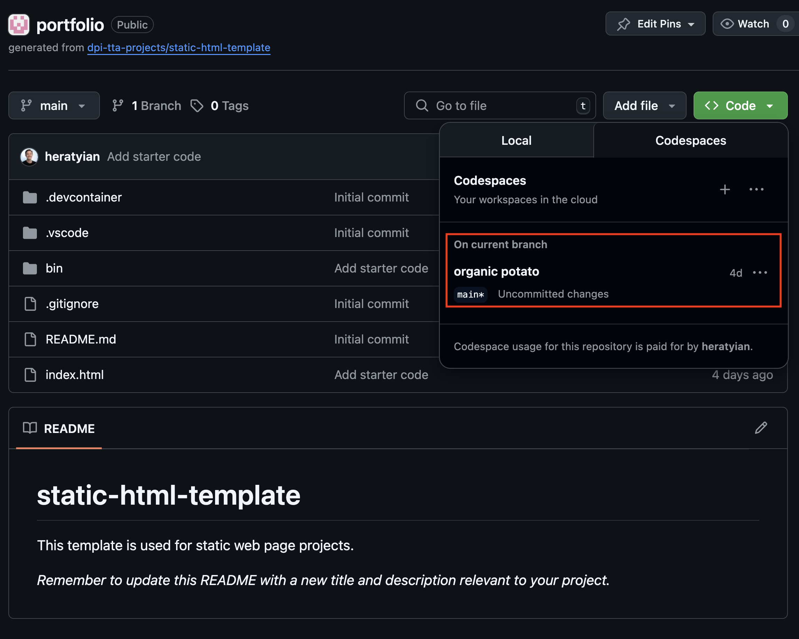
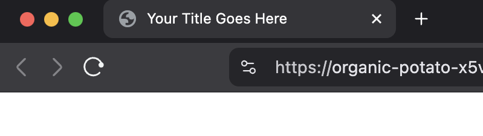
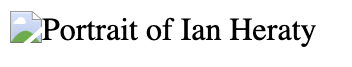
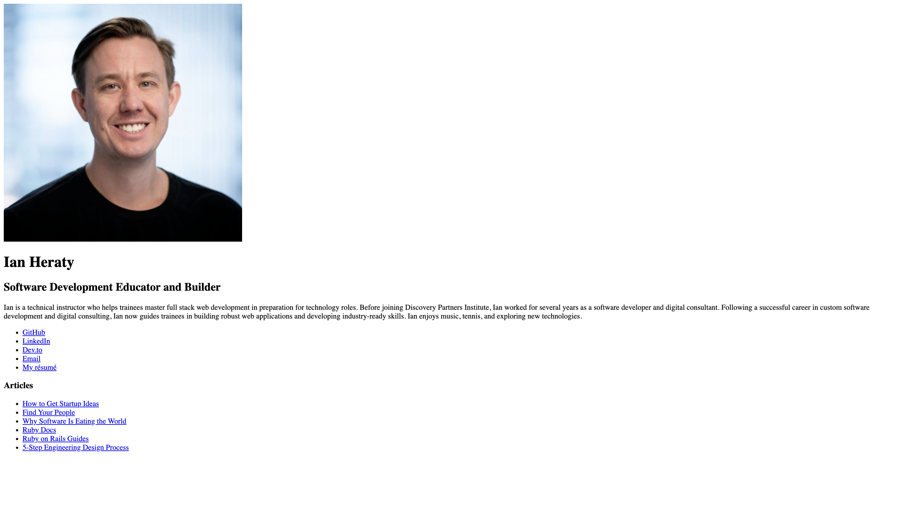
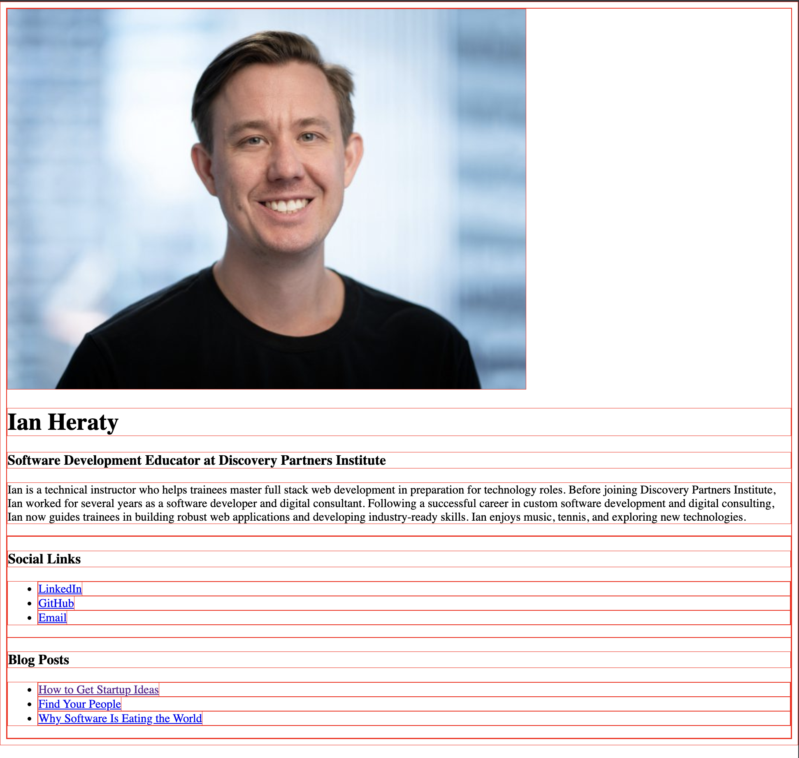

# Build Your Portfolio Page

Create a personal portfolio webpage to showcase your work and make it easy for others to find your projects online.

## Goal

In this lesson, you'll build a mobile-friendly portfolio website using HTML and CSS inside a GitHub Codespace.

<video src="assets/portfolio-pwa.mp4" width="300px" autoplay loop muted playsinline></video>

<!-- TODO: swap out my personal portfolio link for a generic stand in? -->
Check out this example for yourself [heratyian.github.io](https://heratyian.github.io) and use it as a target. Use the [dev toolbar inspector](#inspector) to see the code for yourself.

## Why You Need a Portfolio

As a developer, having a portfolio gives you a space to:

- Share your projects
- Tell your story
- Show off your skills
- Be discoverable by employers or collaborators

## 1. Reuse Your Codespace

Open the same Codespace you used in the [Getting Started with GitHub Codespaces](/lessons/github-codespaces-vscode) lesson to create your `<h1>Hello, world!</h1>` app. You can access your codespaces here [https://github.com/codespaces](https://github.com/codespaces).

Alternatively, navigate to the repository where you created your Codespace (e.g. `your-username/hello-world`). Click the green **Code** button and then the **Codespaces** tab to reopen your environment.



<aside class="warning">
  If you haven’t set up a Codespace before, start with this lesson <a href="/lessons/github-codespaces-vscode">Getting Started with GitHub Codespaces</a> to create a new repo from the <a href="https://github.com/dpi-tta-projects/static-html-template" target="_blank">static-html-template</a>.
</aside>

Open the `index.html` file we created in [Getting Started with GitHub Codespaces](/lessons/github-codespaces-vscode) and get ready to write the HTML and CSS we need for your portfolio.

## 2. Gather Your Content

You'll need:

- A headshot or avatar image
- A short bio and tagline
- Links to projects, blog posts, websites and/or social media

## 3. Start with the HTML Boilerplate

<aside class="tip">
  <strong>What does "boilerplate" mean?</strong><br>
  In programming, "boilerplate" refers to snippets of code that are repeated multiple times with little (or no) variation. When using languages that are considered verbose, programmers must write a lot of boilerplate code to accomplish only minor functionality.
</aside>

Here's a complete basic layout:

```html
<!DOCTYPE html>
<html lang="en">
  <head>
    <meta charset="UTF-8">
    <title>Your Title Goes Here</title>
  </head>
  <body>
    <!-- Your content goes here -->
  </body>
</html>
```
{: .repl }

<aside class="tip">
  You wont see anything rendered when you click `run` because we haven't added any content inside the <code>body</code> element.
</aside>

Replace your `<h1>Hello, world</h1>` with this layout in your `index.html` file. We'll add content to the body in the [next step](#4-build-the-page-layout).

### What Each Line Does

#### Doctype

```html
<!DOCTYPE html>
```

Declares that this file uses HTML5 — the current standard.

#### HTML lang Attribute

```html
<html lang="en">
```
Starts the HTML document. The `lang="en"` tells browsers (and screen readers) that the content is in English.

#### Head

```html
<head>
```

The head section contains setup info about your page — like the title, fonts, or meta tags. This content doesn’t appear directly on the page, but tells the browser how to present information. We'll cover this later in the lesson.

<aside class="tip">
  We call this machine-readable information "metadata". Metadata is data that describes data. For example, an HTML document is data, but HTML can also contain metadata in its <code>head</code> element that describes the document.

  <cite>
    <a href="https://developer.mozilla.org/en-US/docs/Glossary/Metadata">
      MDN
    </a>
  </cite>
</aside>

#### Charset

```html
<meta charset="UTF-8">
```

Makes sure your page can display all types of characters — symbols, emojis, accents, etc. It is used to ensure that the browser correctly interprets the characters and symbols on the webpage, commonly set as UTF-8 for universal character support across languages and symbols.

#### Title

```html
<title>Your Title Goes Here</title>
```

Sets the text that appears in the browser tab.



<aside class="warning">
  Make sure to change this to something relevant for your portfolio website (maybe your name?).
</aside>

#### Body

```html
<body>
```

This is the visible part of your site — everything inside the `<body>` tags show up in the browser window.

## 4. Build the Page Layout

Before getting bogged down in code, let's start out by sketching out what we want to build. This will provide a starting point and allow us to map out each step. Don't worry about getting everything pixel perfect, just focus on the high level concept. [Sketching with a Sharpie](https://signalvnoise.com/posts/466-sketching-with-a-sharpie)

<div style="max-width: 375px">
  
</div>

Now that we have a high-level sketch, we can draw a box around each element and give it a name.

<div style="max-width: 375px">
  
</div>

Remember, [every element in HTML is treated like a box](/lessons/html-css-basics#understanding-the-box-around-elements)

<!-- don't give away everything. encourage students to use the inspector and figure out how to build it -->

Add this basic structure to your body, replacing the `<!-- Your content goes here -->` comment. It's a good practice to use comments to document your code and add `TODO`s. You wont see anything when you run this repl because comments are invisible to users.

```html
<!-- TODO: avatar -->
<!-- TODO: headline -->
<!-- TODO: tagline -->
<!-- TODO: bio -->
<!-- TODO: icon-links -->
<!-- TODO: article-links -->
```
{: .repl }

<!-- TODO: show gif of shortcut to add comments cmd + '/' -->

### Adding an Avatar Image

Let's add our avatar image. Let's create a folder for our images. It's a common convention to have an `assets` folder. We can create a folder for `images` here. Go ahead and drag your image into the explorer and place it in `assets/images`. Let's rename this file `avatar` so we can easily reference it in our code.

<!-- TODO: show drag and drop into codespace -->
<!-- show final view of codespace with image -->

<!-- TODO: adding images / assets -->
<aside class="tip">
  Use all lowercase kebab-case for filenames (eg my-avatar.jpg) to avoid broken links and stay consistent across platforms. Even though filename casing does not affect functionality, it's a good practice to follow a convention and be consistent. Also, casing becomes very important in some languages.
</aside>

Now we'll use the [image embed element](https://developer.mozilla.org/en-US/docs/Web/HTML/Reference/Elements/img), ``, to add our avatar to the page.

```html
<!-- NOTE: your src path will depend on where you put the image file -->

```
{: .repl }

#### Missing Image Icon



You will likely notice a 'broken image icon' after pasting in the basic layout code. This happens when the browser can not find the image at the given path, `src=""`. When this happens, the browser falls back to the value set to `alt`, in our case `"Portrait of Ian Heraty"`.

Let's add our image to the codespace so we can fix this broken image. A standard practice is to have an `assets` folder for images, stylesheets, and scripts needed to run our app. Create the `assets` folder and another folder inside called `images`. Now we'll update the `src` attribute to point to our avatar image `assets/images/my-avatar-file`.

<aside class="tip">
  <code>/</code> is used to indicate a file path in unix systems. For example, if we have a file path <code>assets/images/my-avatar-file.png</code>, this indicates the <code>my-avatar-file.png</code> is inside the <code>images</code> folder, which is inside the <code>assets</code> folder.
</aside>

<video src="assets/fix-broken-image.mp4" autoplay loop muted playsinline></video>

### Headings

Let's add our headline using a heading element. We'll use `<h1>` for the headline. [Every page should have 1 (and only 1) `<h1>` element](https://developer.mozilla.org/en-US/docs/Web/HTML/Reference/Elements/Heading_Elements#avoid_using_multiple_h1_elements_on_one_page).

```html
<h1>Headline Goes Here</h1>
```
{: .repl }

Some tips from [MDN Web Docs](https://developer.mozilla.org/en-US/docs/Web/HTML/Reference/Elements/Heading_Elements) on using heading elements:

- Heading information can be used by user agents to construct a table of contents for a document automatically.
- Do not use heading elements to resize text. Instead, use the CSS `font-size` property.
- Do not skip heading levels: always start from `<h1>`, followed by `<h2>` and so on.

With this in mind, we'll use a `<h2>` for our tagline.

```html
<h2>Tagline goes here</h2>
```
{: .repl }

### Paragraphs

We'll use [the Paragraph element](https://developer.mozilla.org/en-US/docs/Web/HTML/Reference/Elements/p), `<p>` for our bio.

```html
<p>Your bio goes here</p>
```
{: .repl }

### Icon Links

We'll use [The Unordered List element](https://developer.mozilla.org/en-US/docs/Web/HTML/Reference/Elements/ul), `<ul>`, with the list item element, `<li>` for each link. For the link we'll use [the anchor element](https://developer.mozilla.org/en-US/docs/Web/HTML/Reference/Elements/a), `<a>`. 

Why do we use the list element around each link?

1. These links belong together as a set. These icon links are all related and represent a list of navigation options. Wrapping these links in a `<ul>` communicates this relationship clearly.

2. Accessibility. Assistive technologies like screen readers will announce how many items are in the list, making navigation clearer. eg "List with 3 items: GitHub, LinkedIn, dev.to".

```html
<h3>Icon Links</h3>
<ul>
  <li>
    <a href="https://github.com/" target="_blank" title="GitHub">
      😼
    </a>
  </li>
  <li>
    <a href="https://www.linkedin.com/" target="_blank" title="LinkedIn">
      🧑‍💼
    </a>
  </li>
  <li>
    <a href="https://dev.to/" target="_blank" title="dev.to">
      📝
    </a>
  </li>
</ul>
```
{: .repl}

<aside class="tip">
  Notice how we use indents to indicate nesting. Typically, opening and closing tags should be either on the same line or vertically aligned. This helps us humans read the code and more easily identify bugs.
</aside>

### Article Links

Now we'll use the list element (`<ul>`), list item (`<li>`), and anchor link (`<a>`) to add links to articles. We'll use a `<h3>` tag to give this section a heading.

```html
<h3>Articles</h3>
<ul>
  <li>
    <a href="https://paulgraham.com/startupideas.html" target="_blank">
      How to Get Startup Ideas
    </a>
  </li>
  <li>
    <a href="https://foundersatwork.posthaven.com/find-your-people" target="_blank">
      Find Your People
    </a>
  </li>
  <li>
    <a href="https://a16z.com/why-software-is-eating-the-world/" target="_blank">
      Why Software Is Eating the World
    </a>
  </li>
</ul>
```
{: .repl}

### More HTML Elements

Here are some more HTML elements that may come in handy while building out your portfolio page.

|   Element  |                     Description                                             |                                           Link                                          |
| ---------- | --------------------------------------------------------------------------- | --------------------------------------------------------------------------------------- |
| `<header>` | Contains introductory content (like your name and avatar)                   | [Details](https://developer.mozilla.org/en-US/docs/Web/HTML/Reference/Elements/header)  |
| `<main>`   | Main content of the document (what the page is about)                       | [Details](https://developer.mozilla.org/en-US/docs/Web/HTML/Reference/Elements/main)    |
| `<section>`| A thematically grouped chunk of content                                     | [Details](https://developer.mozilla.org/en-US/docs/Web/HTML/Reference/Elements/section) |
| `<div>`    | Generic container with no semantic meaning (use when nothing else fits)     | [Details](https://developer.mozilla.org/en-US/docs/Web/HTML/Reference/Elements/div)     |



Your website should start looking something like our [target](heratyian.github.io) (replacing all the placeholder images, links, and text with your own content).

<!-- TODO: encourage students to use devtools to debug and see other sites -->
## Using Devtools

Now that you're a developer, you should familiarize yourself with the developer tools built in to web browsers like Chrome.

### View Page Source

In Chrome, right-click anywhere on a webpage and choose `View Page Source`. This helps you learn how other websites are built!

<video src="assets/view-page-source.mp4" autoplay loop muted playsinline></video>

Keyboard Shortcut:

- Ctrl + U (Windows)
- Command ⌘ + Option ⌥ + U (Mac)

### Inspector

In Chrome, right-click anywhere on a webpage and choose `Inspect`. This allows you to click on any element and see the code.

<video src="assets/inspector.mp4" autoplay loop muted playsinline></video>
  
Keyboard Shortcut:

- Ctrl + I (Windows)
- Command ⌘ + Option ⌥ + I (Mac)

---

When you've got all your own content setup, you can move on to [styling](#5-styling).

## 5. Style

Now that you have your HTML layout in place, let's start styling it. Let's start by adding `<style>` tags to our `<head>`. This is where we'll put our css selectors and styles.

```html
<!-- nested in your <head> -->
<style>
  /* selectors and styles will go here */
</style>
```
{: .copyable }

### Add a Debug Border

To visualize layout areas during development, add this to your CSS:

```css
* {
  border: 1px solid red;
}
```
{: .copyable }

```html
<style>
* {
  border: 1px solid red;
}
</style>

<div>
  <p>The * selector targets all elements. Notice how every element is wrapped in a border.</p>
</div>
```
{: .repl }

Add this debug border while building out layouts. You can remove this style rule later once you're happy with the layout.



### Base Styles

Let's add some base styles. We'll target the `body` selector so these styles are applied to all visible elements on the page.

```css
/* ========== base ========== */

body {
  margin: auto;
  padding: 2rem;
  max-width: 640px;
  box-sizing: border-box;
}
```

Let's break this down:

```css
body {
```

Here we're targeting the `<body>` element of the HTML document. This sets global layout and typography styles for the whole page.

```css
margin: auto;
```

Centers the `<body>` horizontally in its container (only if a `width` or `max-width` is set). Common for centering fixed-width content. [MDN](https://developer.mozilla.org/en-US/docs/Web/CSS/margin)

```css
padding: 2rem;
```

Adds space inside the body (between the edge of the body and its content). `2rem` is 2 times the `root` element’s font size (often 32px if the base is 16px). Helps give content breathing room from the edge of the viewport. [MDN](https://developer.mozilla.org/en-US/docs/Web/CSS/padding)

```css
max-width: 640px;
```

Restricts the body’s width to no more than `640px`, even on large screens. Prevents content from becoming too wide and hard to read. Works with `margin: auto;` to center the content block. [MDN](https://developer.mozilla.org/en-US/docs/Web/CSS/max-width)

```css
box-sizing: border-box;
```

Changes how width and height are calculated: padding and border are included in the total width/height. Makes layout easier to manage because dimensions behave more intuitively. [MDN](https://developer.mozilla.org/en-US/docs/Web/CSS/box-sizing)

### Using the Dev Tools Elements Panel

Use the dev tools elements panel to select the `<body>` element. You'll see all the styles being applied to this element in the styles panel. You can toggle each style individually to see its effect on the layout in realtime.

<video src="assets/toggle-styles-inspector.mp4" autoplay loop muted playsinline></video>

### Fonts

Fonts help express the personality of your website and improve readability. By default, browsers use system fonts, but you can customize them easily with CSS.

#### System Fonts

Your browser automatically picks a system font, like: `Arial`, `Times New Roman`, `Georgia`, `Courier New`, `Verdana`. [MDN](https://developer.mozilla.org/en-US/docs/Web/CSS/font-family)

You can use them like this:

```css
body {
  font-family: Arial, sans-serif;
}
```
{: .copyable }

<aside class="tip">
  Always include a generic fallback like <code>sans-serif</code> or <code>serif</code> to ensure consistent display across devices.
</aside>

#### Add a Custom Font with Google Fonts

[Google Fonts](fonts.google.com) lets you use beautiful, free fonts with just a couple lines of code.

##### Step 1: Choose a Font

Visit [fonts.google.com](fonts.google.com), pick a font, and click "Select this style". Then copy the `<link>` tag provided.

For example, to use Roboto:

```html
<link href="https://fonts.googleapis.com/css2?family=Roboto&display=swap" rel="stylesheet">
```
{: .copyable }

Paste this inside your `<head>` element, like this:

```html
<head>
  ...
  <link href="https://fonts.googleapis.com/css2?family=Roboto&display=swap" rel="stylesheet">
</head>
```

##### Step 2: Apply the Font with CSS

```css
body {
  font-family: 'Roboto', sans-serif;
}
```
{: .copyable }

<aside class="tip">
Always include the fallback font after the custom one. If the custom font fails to load, the browser will use the fallback.
</aside>

### Avatar

Let’s style your avatar image so it appears centered, circular, and neatly sized.

#### 1. Use `img` tag

Add the image to your HTML and give it a descriptive `alt` and a `class` of avatar:

```html

```
{: .repl }

<aside class="tip">
Use all lowercase, kebab-case for filenames (like <code>avatar.png</code>) to avoid broken links and stay consistent across platforms.
</aside>

#### 2. Style Your Avatar

Inside your `<style>` block, add this CSS:

```html
<style>
  .avatar {
    width: 150px;
    height: 150px;
    border-radius: 100%;
    object-fit: cover;
    display: block;
    margin-left: auto;
    margin-right: auto;
  }
</style>


```
{: .repl }

Why This Works:

- `border-radius: 100%`: Rounds the image into a perfect circle. [MDN](https://developer.mozilla.org/en-US/docs/Web/CSS/border-radius)
- `object-fit: cover`: Ensures the image fills its box without distortion. [MDN](https://developer.mozilla.org/en-US/docs/Web/CSS/object-fit#cover)
- `display: block`: The element generates a block box, generating line breaks both before and after the element when in the normal flow. [MDN](https://developer.mozilla.org/en-US/docs/Web/CSS/display#block)
- `margin-left: auto` / `margin-right: auto`: Horizontally centers the image. [MDN](https://developer.mozilla.org/en-US/docs/Web/CSS/margin)

<aside class="tip">
You can adjust <code>width:</code> and <code>height:</code> to make the avatar larger or smaller in one place.
</aside>

Once added, your avatar should appear centered and neatly cropped into a circle.

## 6. Make It Responsive

Most people will visit your site on a phone or tablet. That's why modern web design follows a "mobile-first" approach: starting with smaller screens and scaling up from there. This ensures your site stays functional, fast, and easy to use on any device.

Chrome-based browsers include built-in tools to preview how your site looks across different screen sizes.

### Toggle Device Toolbar

To preview how your site looks on different screen sizes:

- Right-click your site → **Inspect**
- Click the **Toggle device toolbar** icon

Keyboard Shortcut:

- Ctrl + Shift + M (Windows)
- Command ⌘ + Shift + M (Mac)

This simulates phones, tablets, and other devices in your browser.

<video src="assets/toggle-device-toolbar.mp4" autoplay loop muted playsinline></video>

### Viewport

Without a viewport meta tag, mobile browsers default to rendering your page as if it were designed for a desktop screen. This usually results in your site looking zoomed out and unreadable on small devices.

<video src="assets/viewport.mp4" autoplay loop muted playsinline></video>

To fix this, you need to explicitly set the viewport so your layout adapts to the screen size.

In the `<head>`, make sure this tag is present:

```html
<meta name="viewport" content="width=device-width, initial-scale=1.0">
```
{: .copyable }

#### What This Does

- `width=device-width`: Sets the viewport to match the screen’s width.
- `initial-scale=1.0`: Sets the default zoom level when the page loads.
- This tells the browser: "Display this page at full width on whatever device you're using."

<aside class="tip">
Without this tag, even well-written responsive CSS won’t work properly on mobile.
</aside>

You’ll notice that after adding the viewport meta tag, your layout stops being tiny on mobile: text sizes normalize, widths respond, and users don’t have to pinch-zoom.

#### Use Flexible Layouts

In addition to setting the viewport, avoid using fixed pixel widths like width: `500px` in your CSS. Instead, prefer:

- `max-width`: allows elements to shrink on small screens
- `width: 100%`: lets content scale with the container
- `rem`, `%`, or `em`: relative units that scale more gracefully

```css
img {
  width: 100%;
  max-width: 150px;
}
```
{: .copyable }

<aside class="warning">
A fixed width like <code>width: 500px;</code> may look fine on desktop, but will overflow on smaller screens.
</aside>

### Understanding CSS Units: px, em, rem, and %

When writing styles, you’ll need to choose how to size things: text, spacing, widths, images, and more. The unit you use affects how responsive and flexible your layout is.

#### `px` – Pixels (Absolute Unit)

A pixel is a fixed-size unit. `20px` means exactly 20 screen pixels. It's predictable but not responsive.

```css
h1 {
  font-size: 32px;
}
```

<aside class="warning">
Using only `px` can make your site harder to scale or adjust for different screen sizes or accessibility needs.
</aside>

#### `em` – Relative to Parent Font Size

`1em` equals the font size of the parent element. It scales based on nesting.

```css
p {
  font-size: 1em;   /* same size as parent */
}
li {
  padding-left: 2em;  /* 2x the parent font size */
}
```

<aside class="tip">
Useful for spacing that adapts with font size—but can compound if you’re not careful with nesting.
</aside>

#### `rem` – Relative to Root Font Size

`1rem` equals the root element's font size (usually `16px` by default). It’s more consistent than `em`.

```css
body {
  font-size: 1rem;  /* usually 16px */
}
h1 {
  font-size: 2rem;  /* 32px */
}
```

<aside class="tip">
Use <code>rem</code> for sizing that stays consistent across your site.
</aside>

#### `%` – Percentage

A percentage is relative to the size of the parent element.

```css
img {
  width: 100%; /* fills the container */
}
```

Useful for layouts that need to stretch or shrink based on the screen or container size.

#### Best Practices

Use relative units like `rem`, `em`, and `%` for responsive, accessible designs. Avoid relying solely on `px`, especially for fonts and layout widths.

### Make Your Styles Adapt to Screen Size

Media queries let you apply CSS only when certain conditions are true: like when the screen is wider than a certain size. They're the backbone of responsive design.

Let’s say you want your content to be slightly wider on large screens.

```css
body {
  max-width: 640px;
}
```
{: .copyable }

This sets a max width for small to medium screens. But on larger screens, like laptops or desktops, you might want a little more space.

Here’s how to do that with a media query:

```css
@media (min-width: 992px) {
  body {
    max-width: 720px;
  }
}
```
{: .copyable }

This tells the browser:

"When the viewport is at least `992px` wide, increase the `max-width` of the `<body>` to 720px."

<video src="assets/media-query-max-width.mp4" autoplay loop muted playsinline></video>

#### Try It Yourself

Add both of these blocks to your `<style>` and use Chrome’s device toolbar to preview how the layout changes at different breakpoints.

##### Common Breakpoints

```css
/* Small phones */
@media (max-width: 576px) { ... }

/* Tablets */
@media (min-width: 768px) { ... }

/* Desktops */
@media (min-width: 992px) { ... }

/* Large screens */
@media (min-width: 1200px) { ... }
```

<aside class="tip">
These are just conventions. Pick breakpoints that match your content, not specific devices.
</aside>

## 7. Use Font Awesome Icons

Add this to your `<head>`:

```html
<link rel="stylesheet" href="https://cdnjs.cloudflare.com/ajax/libs/font-awesome/6.7.2/css/all.min.css" />
```
{: .copyable }

Now you can use icons like:

```html
<i class="fab fa-github"></i> GitHub
```
{: .copyable }

```html
<link rel="stylesheet" href="https://cdnjs.cloudflare.com/ajax/libs/font-awesome/6.7.2/css/all.min.css" />

<i class="fab fa-github"></i> GitHub
```
{: .repl }

<!-- TODO: box-shadow, :hover, :focus -->

## 8. Make Your Link Previews Stand Out

<!-- TODO: make port public to use on metatags io. (does this work?) -->

To make your page look great when shared, use MetaTags.io to generate a preview and copy the meta tags into your HTML.

<aside class="tip">
  Meta tags help social platforms like LinkedIn or Twitter show a nice preview when someone shares your link.
</aside>

<!-- TODO: add screenshot -->

<!-- TOOD: add practical meta tag examples 

<meta property="og:title" content="Ian Heraty's Portfolio">
<meta property="og:image" content="/assets/avatar.jpg">
<meta property="og:description" content="Software Development Educator and Mentor">
<meta property="og:url" content="https://yourdomain.com">

-->

<!-- TODO

add note on using variables in the :root pseudo class to create global variables

add aside on indents and formatting to improve readability 

maybe do this in a subsequent "code review" lesson?

In VS Code, use Cmd+Shift+P (Mac) or Ctrl+Shift+P (Windows), then search “Format Document” to clean up your HTML or CSS automatically.
-->

<!-- TODO: refactoring

refactor and move to `styles/application.css`

```html
<link rel="stylesheet" href="styles/application.css">
```
Connects your HTML to an external CSS file so you can style your page.

TODO: empty cache hard reload + screenshot 

do this after showing link stylesheet

-->

## Validate Your HTML

Use the [W3C Validator](https://validator.w3.org/) to check your code for mistakes. Paste your HTML code or upload the file to check for typos or unclosed tags. This can be a life saver when you can't figure out what's breaking your HTML.

<!-- TODO: add screenshot -->

<!-- TODO: add how to format document in vs code -->

<!-- TODO: pwa setup -->

## What’s Next?

You now have a static site ready to deploy!

<aside class="danger">
  ⚠️ Codespaces shut down after ~30 minutes of inactivity. In the next lesson, you'll learn how to deploy your site so it's available 24/7.
</aside>

In the next lessons, you’ll:

- Host your page online to make it available 24/7
- Get your first "code review"
- Connect a custom domain (optional)

## Practice Challenge

- Add at least 3 links with Font Awesome icons
- Try using a new font from Google Fonts
- Add a background image to your page
